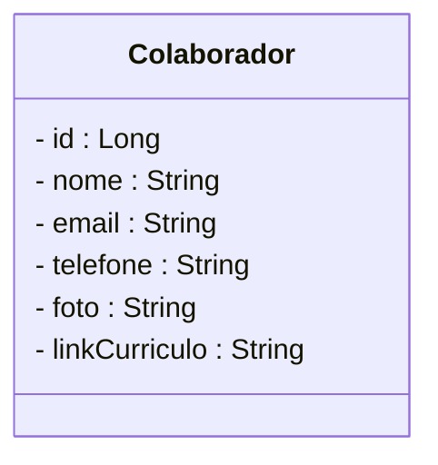
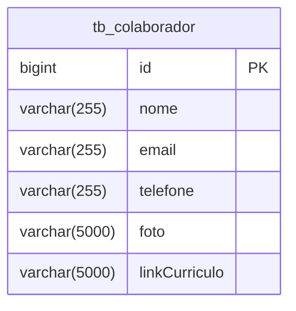

# Sistema de Cadastro de RH - Backend

<br />

<div align="center">
     
</div>

<br />

<div align="center">
  
  
  
  
  
  
  

</div>

<br />


## 1. Descrição

O **Sistema de Cadastro de RH**, Talentys, é uma aplicação backend desenvolvida para gerenciar os principais processos da área de Recursos Humanos, oferecendo funcionalidades como cadastro de colaboradores, recrutamento e seleção, controle de ponto, folha de pagamento e programas de desenvolvimento e treinamento.

------

## 2. Sobre esta API

Esta API RESTful foi construída com Java e Spring Boot, seguindo boas práticas de arquitetura e segurança. Ela fornece endpoints para integração com futuros sistemas frontend ou outras aplicações corporativas.

### 2.1. Principais Funcionalidades

1. Cadastro e gerenciamento de colaboradores  
2. Controle de recrutamento e seleção  
3. Registro de jornada de trabalho e controle de ponto  
4. Geração de dados para folha de pagamento  
5. Gerenciamento de treinamentos e desenvolvimento  

------

## 3. Diagrama de Classes

<br />



<br />

------

## 4. Diagrama Entidade-Relacionamento (DER)

<br />



<br />

------

## 5. Tecnologias utilizadas

| Item                          | Descrição     |
|-------------------------------|---------------|
| **Servidor**                  | Apache Tomcat (embutido no Spring Boot) |
| **Linguagem de programação**  | Java          |
| **Framework**                 | Spring Boot   |
| **ORM**                       | Hibernate (via Spring Data JPA) |
| **Banco de dados Relacional** | MySQL         |

------

## 6. Configuração e Execução

1. Clone o repositório:  
   ```bash
   git clone https://github.com/Grupo-02-Turma-Java-82/rh-backend.git

## 7. Participantes

Este projeto foi desenvolvido por:

- **Bruno Godoy**  
- **Felipe da Silva Peronica Ferreira**  
- **Jovani de Souza**  
- **Lívia D’Alexandri Cunha**  
- **Luiza Gonçalves**  
- **Maria Helena Rocha Squarcini**  
- **Rafaela de Souza Giometti**
